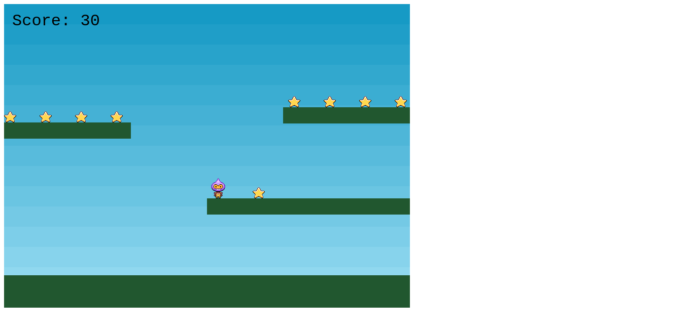

# Phaser 3 Tuto

## Project description
This is a learning tutorial of [Phaser 3](https://phaser.io): a javascript framework for developing HTML5 games

## Built with
Javascript
Webpack
## Author 

> ### :man: Mugirase Emmanuel

* GitHub: [descholar-ceo](https://github.com/descholar-ceo)

* LinkedIn: [MUGIRASE Emmanuel](https://linkedin.com/in/mugirase-emmanuel)

* Twitter: [descholar](https://twitter.com/descholar3)

===> You can find this readme file template [on this link](https://github.com/nezago/nezago-guidelines/wiki/Readme-file-template)
